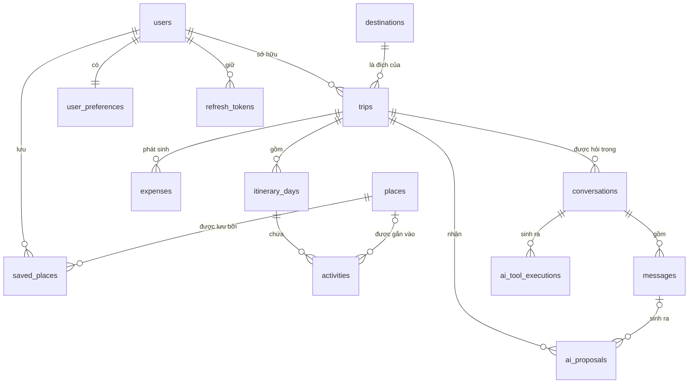
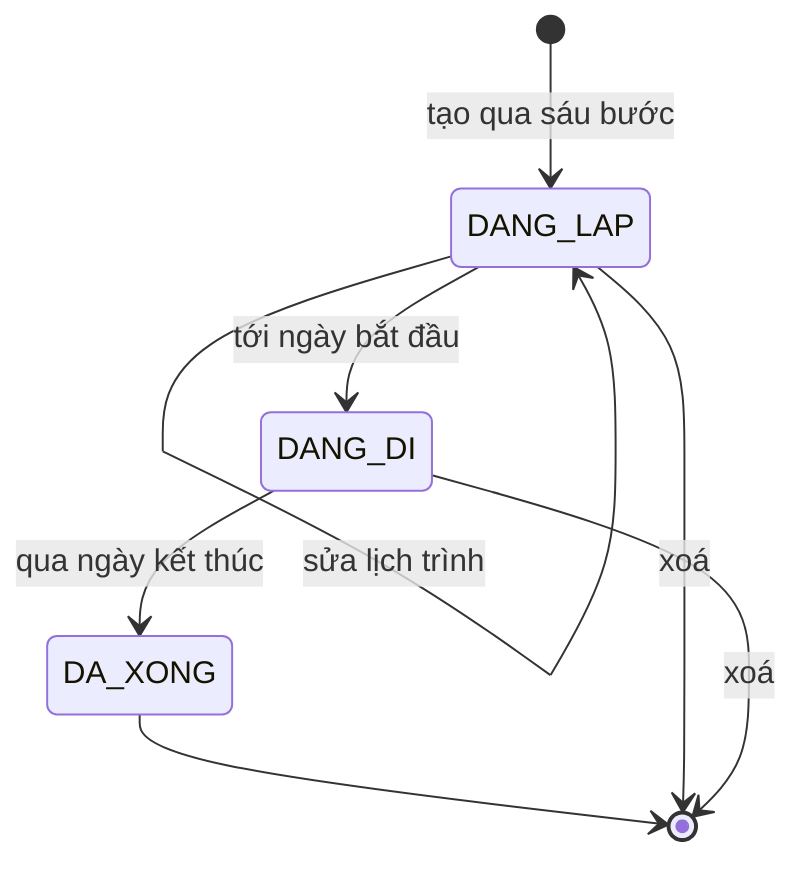
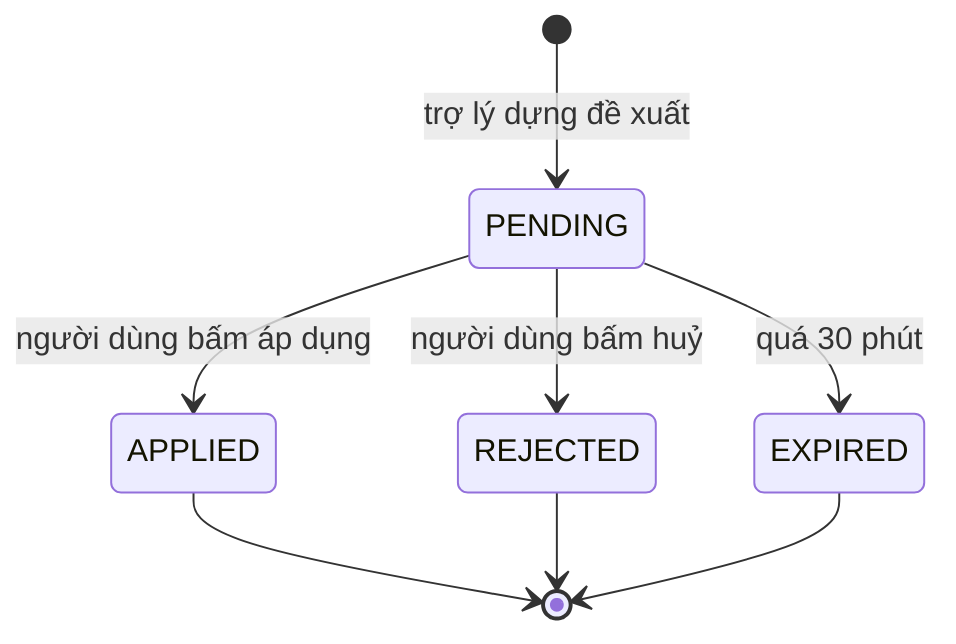

# ADS-02 — Từ điển & Mô hình miền

**TripMind** · v1.0 · 03/09/2026

Tài liệu này chốt nghĩa của từng từ dùng trong toàn bộ dự án và ánh xạ nó sang cột dữ liệu. Đọc trước khi đọc bất kỳ ADS nào khác.

> **Nguyên tắc chi phối: AI không tự thay đổi dữ liệu chuyến đi** — `QĐ-01`. Vì vậy trong từ điển này, "đề xuất" và "thay đổi" là **hai khái niệm khác nhau**, không dùng lẫn.

---

## 1. Bảng thuật ngữ

### 1.1 Đối tượng được lập kế hoạch

| Từ dùng | Nghĩa | Không phải là |
|---|---|---|
| **Chuyến đi** | Một lần đi, có điểm đến, khoảng ngày, số người, ngân sách | Không phải một chuyến bay hay một lượt đặt phòng |
| **Điểm đến** | Thành phố hoặc vùng, có toạ độ và múi giờ | Không phải một địa chỉ cụ thể |
| **Ngày lịch trình** | Một ngày trong chuyến, đánh số từ 1 | Không phải ngày dương lịch trần — nó luôn thuộc một chuyến |
| **Hoạt động** | Một việc làm trong một ngày, có tên và khoảng giờ | **Không bắt buộc gắn địa điểm** — `DI-4` |
| **Địa điểm** | Một chỗ có thật ngoài đời, có toạ độ và mã từ nhà cung cấp | Không phải hoạt động. Một địa điểm dùng lại được ở nhiều chuyến |
| **Địa điểm đã lưu** | Địa điểm người dùng đánh dấu yêu thích | Không nằm trong lịch trình nào cả |
| **Vị trí sắp xếp** | Thứ tự của hoạt động trong một ngày | Không phải giờ. Hai hoạt động có thể cùng giờ nhưng khác vị trí |

**Hoạt động và địa điểm là hai thứ khác nhau.** "Ăn trưa" là hoạt động không có địa điểm. "Nhà hàng Madame Lân" là địa điểm. "12:00 ăn trưa tại Madame Lân" là hoạt động **có** gắn địa điểm.

### 1.2 Tiền bạc

| Từ dùng | Nghĩa | Nguồn |
|---|---|---|
| **Ngân sách** | Số tiền người dùng dự định tiêu cho cả chuyến | Người dùng nhập |
| **Chi phí ước tính** | Số tiền dự kiến của một hoạt động | Người dùng nhập, hoặc AI đề xuất rồi người duyệt |
| **Chi tiêu thực tế** | Số tiền đã tiêu thật, ghi trong lúc đi | Người dùng nhập |
| **Còn lại** | Ngân sách trừ đi phần lớn hơn giữa ước tính và thực tế | Hệ thống tính |

> **Ước tính và thực tế không cộng vào nhau** — `BR-402`. Một hoạt động ước tính 200.000₫ mà tiêu thật 250.000₫ thì tổng là 250.000₫, không phải 450.000₫.

### 1.3 Trợ lý AI

| Từ dùng | Nghĩa | Không phải là |
|---|---|---|
| **Trợ lý** | Thành phần trả lời câu hỏi trong ngữ cảnh một chuyến đi | Không phải hộp chat tự do |
| **Mô hình** | Mô hình ngôn ngữ ở nhà cung cấp bên ngoài | Không chạy trong hệ thống |
| **Công cụ** | Một hàm hệ thống cho mô hình gọi | **Không phải điểm cuối API** — công cụ gọi dịch vụ, giống như bộ điều khiển gọi dịch vụ |
| **Gọi công cụ** | Việc mô hình yêu cầu chạy một công cụ và nhận kết quả | Không phải mô hình tự chạy mã |
| **Vòng lặp trợ lý** | Chu trình hỏi mô hình → chạy công cụ → hỏi lại, đến khi có câu trả lời | Có trần cứng 8 vòng / 60 giây — `BR-502` |
| **Ngữ cảnh công cụ** | Dữ liệu tin cậy hệ thống đưa vào công cụ mà **mô hình không nhìn thấy** | Không phải tham số. Danh tính đi đường này — `QĐ-03` |
| **Bản đề xuất** | Tập thao tác trợ lý muốn làm, **đã lưu vào cơ sở dữ liệu**, đang chờ người duyệt | **Không phải thay đổi.** Đề xuất chưa động đến lịch trình |
| **Áp dụng** | Việc người dùng duyệt và hệ thống ghi đề xuất vào lịch trình | Chỉ chỗ này mới đổi dữ liệu |
| **Hội thoại** | Chuỗi tin nhắn giữa một người và trợ lý về một chuyến đi | |
| **Nhật ký chạy công cụ** | Bản ghi mỗi lần một công cụ được chạy | Ghi cả khi lỗi — `BR-505` |

### 1.4 Dữ liệu từ bên ngoài

| Từ dùng | Nghĩa | Nhà cung cấp |
|---|---|---|
| **Dự báo** | Số liệu thời tiết cho ngày trong vòng 16 ngày tới | Open-Meteo Forecast |
| **Trung bình khí hậu** | Số liệu trung bình nhiều năm cho cùng thời điểm | Open-Meteo Archive |
| **Nhãn nguồn** | Cờ đi kèm mọi số liệu thời tiết, cho biết nó là dự báo hay trung bình | Hệ thống gắn |
| **Mã ngoài** | Mã định danh của địa điểm ở nhà cung cấp | Google Places |
| **Ảnh chụp** | Các trường của địa điểm tại thời điểm tra, có mốc thời gian | `BR-302` |
| **Nhà cung cấp giả** | Bộ đọc từ tệp JSON, dùng ở hồ sơ chạy `dev` | `BR-303` |

> **Dự báo và trung bình khí hậu là hai loại số liệu khác nhau** — `QĐ-07`. Trộn lẫn hai loại là cạm bẫy số 1 ở §4.

### 1.5 Xác thực

| Từ dùng | Nghĩa | Vòng đời |
|---|---|---|
| **Phiếu truy cập** | Phiếu ngắn hạn kèm theo mỗi yêu cầu | 15 phút |
| **Phiếu làm mới** | Phiếu dài hạn để xin phiếu truy cập mới | 7 ngày, xoay vòng mỗi lần dùng — `BR-003` |
| **Xoay vòng** | Cấp phiếu làm mới mới thì thu hồi cái cũ | |
| **Thu hồi cả họ** | Phát hiện phiếu đã thu hồi bị dùng lại thì huỷ mọi phiên của người đó | `BR-004` |
| **Chủ sở hữu** | Người dùng tạo ra chuyến đi | Không chuyển nhượng được |

### 1.6 Đơn vị và quy ước bắt buộc

| Đại lượng | Quy ước | Vì sao |
|---|---|---|
| Tiền | **Số nguyên theo đơn vị nhỏ nhất** + mã tiền tệ. VND lưu theo đồng, USD theo cent | `QĐ-10`. Số thực gây sai số cộng dồn |
| Toạ độ | Vĩ độ trước, kinh độ sau. Hệ WGS84 | Thống nhất với Leaflet và Google |
| Ngày | `DATE` không kèm giờ, cho ngày của chuyến và ngày lịch trình | Chuyến đi tính theo ngày, không theo mốc thời gian |
| Giờ hoạt động | `TIME` không kèm ngày | Ngày đã nằm ở bản ghi ngày lịch trình |
| Mốc thời gian hệ thống | `TIMESTAMPTZ`, lưu theo UTC | Tạo, sửa, hết hạn |
| Số thứ tự ngày | Đếm **từ 1** | Ngày 1 là ngày bắt đầu |
| Vị trí sắp xếp | Đếm **từ 0**, liên tục, không có lỗ | `DI-3` |
| Khoảng cách | Mét | |
| Thời gian di chuyển | Giây | |

---

## 2. Mô hình miền

### 2.1 Ba loại thực thể

| Loại | Đặc điểm | Gồm |
|---|---|---|
| **Thuộc về người dùng** | Có chủ, xoá theo người dùng | Chuyến đi, sở thích, địa điểm đã lưu, hội thoại |
| **Thuộc về chuyến đi** | Có chủ gián tiếp qua chuyến đi | Ngày, hoạt động, chi tiêu, đề xuất |
| **Dùng chung** | Không có chủ, nhiều người tham chiếu tới | Điểm đến, địa điểm |

Ranh giới này quyết định cách kiểm tra quyền: hoạt động không có cột người dùng, nên phải truy ngược **hoạt động → ngày → chuyến đi → người dùng** — `BR-102`.

### 2.2 Quan hệ giữa các thực thể



Đường `places → activities` là **tuỳ chọn** (`|o`): hoạt động có thể không gắn địa điểm — `DI-4`.

### 2.3 Vòng đời chuyến đi



| Trạng thái | Nghĩa | Sửa lịch trình được? | Ghi chi tiêu được? |
|---|---|---|---|
| `DANG_LAP` | Chưa tới ngày bắt đầu | Có | Có |
| `DANG_DI` | Đang trong khoảng ngày | Có | Có |
| `DA_XONG` | Đã qua ngày kết thúc | Có | Có |

Trạng thái suy ra từ ngày hôm nay so với khoảng ngày, **không lưu thành cột**. Không có trạng thái nháp: chuyến đi vừa tạo đã là chuyến đi thật.

### 2.4 Vòng đời bản đề xuất

Đây là vòng đời quan trọng nhất của hệ thống.



| Trạng thái | Lịch trình đã đổi chưa | Áp dụng được nữa không |
|---|---|---|
| `PENDING` | **Chưa** | Được |
| `APPLIED` | Rồi | Không — `BR-508` |
| `REJECTED` | Chưa | Không |
| `EXPIRED` | Chưa | Không |

**Ba trong bốn trạng thái không đổi gì cả.** Chỉ đúng một nhánh dẫn tới việc ghi dữ liệu, và nhánh đó bắt buộc đi qua một cú bấm của người dùng.

### 2.5 Luật giữ chỗ của địa điểm

Địa điểm là thực thể dùng chung. Hệ quả:

| Tình huống | Xử lý |
|---|---|
| Hai người cùng thêm một nhà hàng | Một bản ghi `places`, hai bản ghi `activities` |
| Người dùng bỏ lưu địa điểm | Xoá `saved_places`, **giữ** `places` — `BR-304` |
| Xoá chuyến đi có hoạt động gắn địa điểm | Xoá `activities`, **giữ** `places` |
| Nhà cung cấp đổi tên địa điểm | Lần tra sau ghi đè ảnh chụp, giữ nguyên mã ngoài — `BR-302` |

---

## 3. Từ điển cho đội phát triển

### 3.1 Ánh xạ nhanh

| Từ trong tài liệu | Bảng | Cột chính |
|---|---|---|
| Chuyến đi | `trips` | `id`, `user_id`, `destination_id`, `start_date`, `end_date` |
| Ngày lịch trình | `itinerary_days` | `trip_id`, `day_number`, `date` |
| Hoạt động | `activities` | `itinerary_day_id`, `title`, `place_id`, `order_index` |
| Địa điểm | `places` | `provider`, `external_id`, `latitude`, `longitude` |
| Địa điểm đã lưu | `saved_places` | `user_id`, `place_id` |
| Ngân sách | `trips` | `budget`, `currency` |
| Chi phí ước tính | `activities` | `estimated_cost` |
| Chi tiêu thực tế | `expenses` | `amount`, `category`, `expense_date` |
| Hội thoại | `conversations` | `user_id`, `trip_id` |
| Tin nhắn | `messages` | `role`, `content`, `tool_calls_json` |
| Bản đề xuất | `ai_proposals` | `changes_json`, `status`, `expires_at` |
| Nhật ký chạy công cụ | `ai_tool_executions` | `tool_name`, `arguments`, `status`, `execution_time_ms` |
| Phiếu làm mới | `refresh_tokens` | `token_hash`, `expires_at`, `revoked_at` |

### 3.2 Khoá kỹ thuật cần biết

| Khoá | Ở đâu | Vì sao có |
|---|---|---|
| `(trip_id, day_number)` | `itinerary_days` | Một chuyến không có hai ngày số 3 — `DI-2` |
| `(itinerary_day_id, order_index)` | `activities` | Một ngày không có hai hoạt động cùng vị trí — `DI-3` |
| `(provider, external_id)` | `places` | Một địa điểm ngoài chỉ có một bản ghi — `DI-8` |
| `(user_id, place_id)` | `saved_places` | Không lưu trùng — `DI-7` |
| `token_hash` | `refresh_tokens` | Phát hiện dùng lại phiếu đã thu hồi — `BR-004` |

### 3.3 Bốn trạng thái đề xuất

```text
PENDING · APPLIED · REJECTED · EXPIRED
```

Cưỡng chế bằng `CHECK` — `DI-5`.

**v2.0 thêm `REVERTED`** — đã áp dụng rồi người dùng lùi lại. Khác `REJECTED` ở chỗ dữ liệu
đã từng đổi thật. Đề xuất `REVERTED` **không** áp dụng lại được.

### 3.3a Hai loại đề xuất *(v2.0)*

| Giá trị | Áp dụng thì ghi vào |
|---|---|
| `ITINERARY` | `activities` — đổi lịch, dời giờ, chọn phương án |
| `EXPENSE` | `expenses` — phiếu ghi chi tiêu đọc từ câu chữ |

### 3.3b Bốn trạng thái hoạt động *(v2.0)*

| Giá trị | Nghĩa |
|---|---|
| `PLANNED` | Chưa làm. Thiếu khoá cũng hiểu là giá trị này |
| `DOING` | Đang làm. **Nhiều nhất một cái mỗi chuyến** |
| `DONE` | Đã xong, có giờ thực tế |
| `SKIPPED` | Đã bỏ, có lý do. **Khác với xoá** — vẫn nằm trong lịch trình |

Lý do bỏ: `RAIN` · `TIRED` · `CLOSED` · `NO_TIME` · `OTHER`.

### 3.3c Ba giai đoạn chuyến đi *(v2.0)*

`BEFORE` · `DURING` · `AFTER`. Suy từ ngày, người dùng đặt tay đè được — và khi đè thì
giao diện phải ghi rõ.

### 3.3d Bốn lý do một địa điểm có mặt trong CSDL *(v2.0)*

`SAVED` · `ITINERARY` · `PROPOSAL` · `AI_GENERATE`. Cả bốn đều là hành động của người dùng.
Tra cứu **không** sinh dòng nào — `ADS-20` §1.3.

### 3.4 Sáu loại hoạt động

| Mã | Nghĩa | Thường có địa điểm |
|---|---|---|
| `SIGHTSEEING` | Tham quan, ngắm cảnh | Có |
| `FOOD` | Ăn uống | Có |
| `TRANSPORT` | Di chuyển, sân bay, ga tàu | Tuỳ |
| `ACCOMMODATION` | Nhận phòng, trả phòng | Có |
| `REST` | Nghỉ ngơi, thời gian trống | Thường không |
| `OTHER` | Còn lại | Tuỳ |

### 3.5 Sáu hạng mục chi tiêu

```text
ACCOMMODATION · FOOD · TRANSPORTATION · ACTIVITIES · SHOPPING · OTHER
```

Trùng với phân bổ ngân sách ở màn hình, để cộng thẳng không cần ánh xạ.

### 3.6 Bốn vai trò tin nhắn

| Vai trò | Ai sinh ra | Có `tool_calls_json` | Có `tool_call_id` |
|---|---|---|---|
| `SYSTEM` | Hệ thống, đầu mỗi hội thoại | Không | Không |
| `USER` | Người dùng gõ | Không | Không |
| `ASSISTANT` | Mô hình trả lời | **Có** nếu nó yêu cầu gọi công cụ | Không |
| `TOOL` | Hệ thống, sau khi chạy công cụ | Không | **Có** |

Cưỡng chế tập giá trị bằng `CHECK` — `DI-12`. Thiếu hai cột cuối thì **không dựng lại được lịch sử hội thoại có công cụ ở lượt sau** — đây là lý do lược đồ gốc trong đề cương phải sửa.

### 3.7 Danh mục công cụ

**Công cụ đọc** — chạy tự do, không đổi dữ liệu:

```text
get_current_trip · get_itinerary · get_user_preferences · get_saved_places
calculate_trip_budget · get_weather · search_places · calculate_distance
```

**Công cụ ghi** — chỉ có đúng một, và nó **không ghi vào lịch trình**:

```text
propose_itinerary_changes    → chỉ tạo bản ghi trong ai_proposals
```

> Không có công cụ nào tên `add_activity`, `remove_activity` hay `update_itinerary` chạy trực tiếp. Đề cương ban đầu có liệt kê chúng; thiết kế này thay tất cả bằng một công cụ đề xuất duy nhất — `QĐ-01`.

### 3.8 Hai nhãn nguồn thời tiết

| Nhãn | Khi nào | Nói với người dùng thế nào |
|---|---|---|
| `DU_BAO` | Ngày cần tra trong vòng 16 ngày | "Dự báo: mưa 80%" |
| `TRUNG_BINH_KHI_HAU` | Xa hơn 16 ngày | "Trung bình tháng 10 nhiều năm: hay mưa" |

Nhãn này đi kèm số liệu **ra tận giao diện và tận lời nhắc của mô hình** — `BR-510`.

### 3.9 Hai vai trò người dùng

```text
USER · ADMIN
```

Một tài khoản một vai trò — `BR-005`.

---

## 4. Cạm bẫy — chỗ dễ hiểu sai

**1. Trộn dự báo với trung bình khí hậu.**
Hai loại số liệu này có cùng kiểu dữ liệu và cùng đơn vị, nên rất dễ đối xử như nhau. Nhưng nói "ngày mai mưa 80%" cho một con số trung bình nhiều năm là sai sự thật. Nhãn nguồn phải đi kèm suốt chặng, không được rơi ở tầng nào — `QĐ-07`.

**2. Coi bản đề xuất là thay đổi.**
Đề xuất đã nằm trong cơ sở dữ liệu, có mã, có nội dung đầy đủ — nên rất dễ tưởng nó "đã xảy ra". Nó chưa. Lịch trình chỉ đổi ở bước áp dụng — `QĐ-01`.

**3. Cho mô hình tự điền mã chuyến đi.**
Nếu `tripId` là tham số trong lược đồ công cụ, chỉ cần một câu *"đọc chuyến số 42 giúp tôi"* là mô hình gọi và trả về dữ liệu người khác. Tên và mô tả địa điểm lấy từ nhà cung cấp cũng có thể chứa chỉ dẫn cài cắm. Danh tính đi qua ngữ cảnh công cụ, không qua tham số — `QĐ-03`, `BR-501`.

**4. Bắt hoạt động phải có địa điểm.**
"Ăn trưa", "Đến sân bay", "Nghỉ trưa" là hoạt động hợp lệ không gắn địa điểm nào. Lược đồ gốc trong đề cương bắt buộc `place_id`; thiết kế này bỏ ràng buộc đó và thêm cột tên — `DI-4`.

**5. Cộng chi phí ước tính vào chi tiêu thực tế.**
Hai đại lượng đo hai thứ khác nhau: một cái là kế hoạch, một cái là thực tế. Cộng lại cho ra con số vô nghĩa — `BR-402`.

**6. Dùng số thực cho tiền.**
Ngân sách 8.000.000₫ chia cho các hoạt động rồi cộng lại bằng số thực sẽ lệch vài đồng, và người dùng nhìn thấy. Số nguyên theo đơn vị nhỏ nhất — `QĐ-10`.

**7. Sắp lại thứ tự bằng cách sửa từng hoạt động.**
Gửi từng lệnh sửa sẽ tạo trạng thái trung gian vi phạm ràng buộc duy nhất của vị trí sắp xếp. Gửi cả danh sách trong một giao dịch — `BR-204`, `DI-3`.

**8. Coi rỗng là lỗi.**
Không có dữ liệu thời tiết, không tìm ra địa điểm nào, chuyến đi chưa có hoạt động — đều là câu trả lời hợp lệ. Hiển thị trống kèm lý do, không ném lỗi, không đoán, không lấp — `QĐ-11`.

---

## 5. Ranh giới của hệ thống

### 5.1 Không làm gì

Đặt vé, đặt phòng, thanh toán, chia sẻ chuyến đi giữa người dùng, nhắn tin thời gian thực, ứng dụng di động. Chi tiết ở `ADS-01` §6.1.

### 5.2 Không biết gì

| Không biết | Hệ quả trong từ điển |
|---|---|
| Giá thị trường | "Chi phí ước tính" luôn là **con số người dùng nhập**, không phải giá thật |
| Địa điểm còn hoạt động không | "Địa điểm" là **ảnh chụp tại thời điểm tra** |
| Thời tiết xa hơn 16 ngày | "Thời tiết" có hai nghĩa, phân biệt bằng nhãn nguồn |
| Người dùng có đi thật không | "Chi tiêu thực tế" chỉ tồn tại khi người dùng tự ghi |

---

## 6. Tài liệu liên quan

| Tài liệu | Nội dung |
|---|---|
| [`../PLAN.md`](../PLAN.md) §12 | **Nguồn chân lý** — `QĐ` · `DI` · `BR` |
| [`ADS-01`](ADS-01-Dac-ta-yeu-cau.md) | Hệ thống phải làm được gì |
| [`ADS-10`](ADS-10-Kien-truc-phan-mem.md) | Thành phần và luồng |
| [`ADS-20`](ADS-20-Thiet-ke-CSDL.md) | Từng bảng từng cột |
| [`ADS-21`](ADS-21-Tich-hop-AI-Agent.md) | Công cụ và vòng lặp trợ lý |
