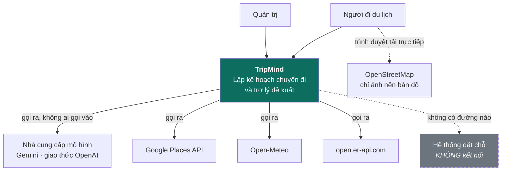
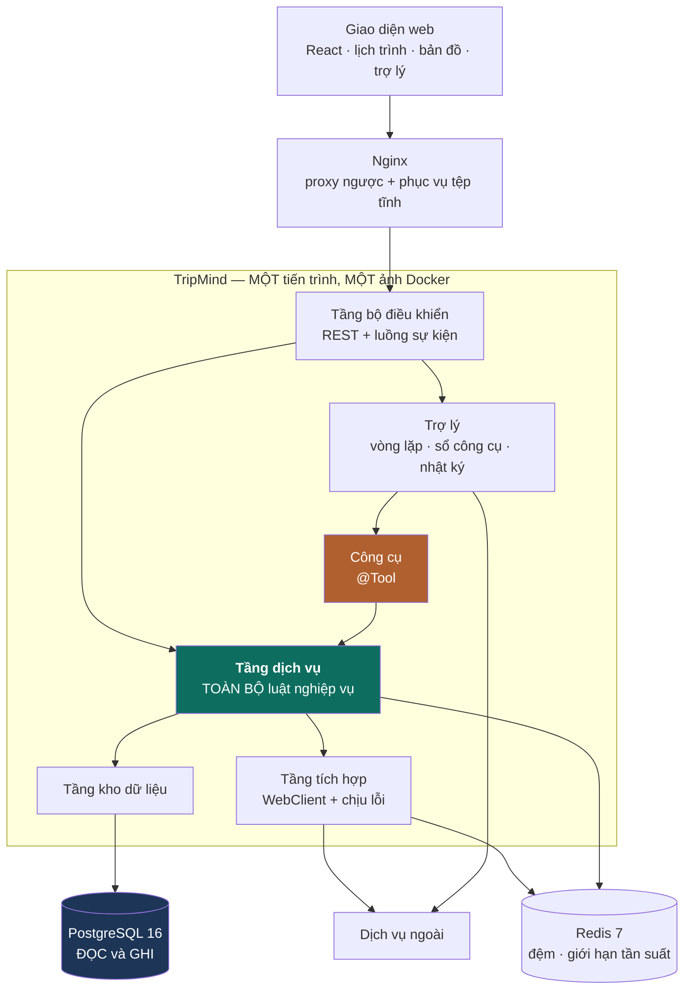
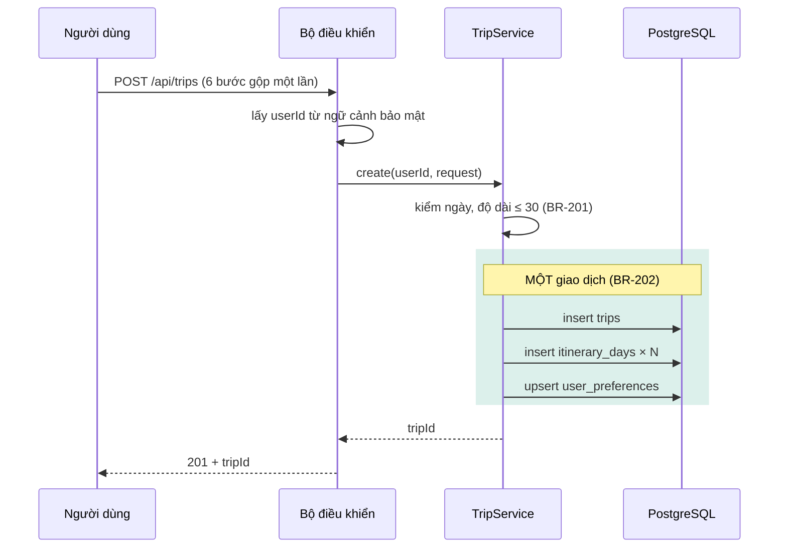
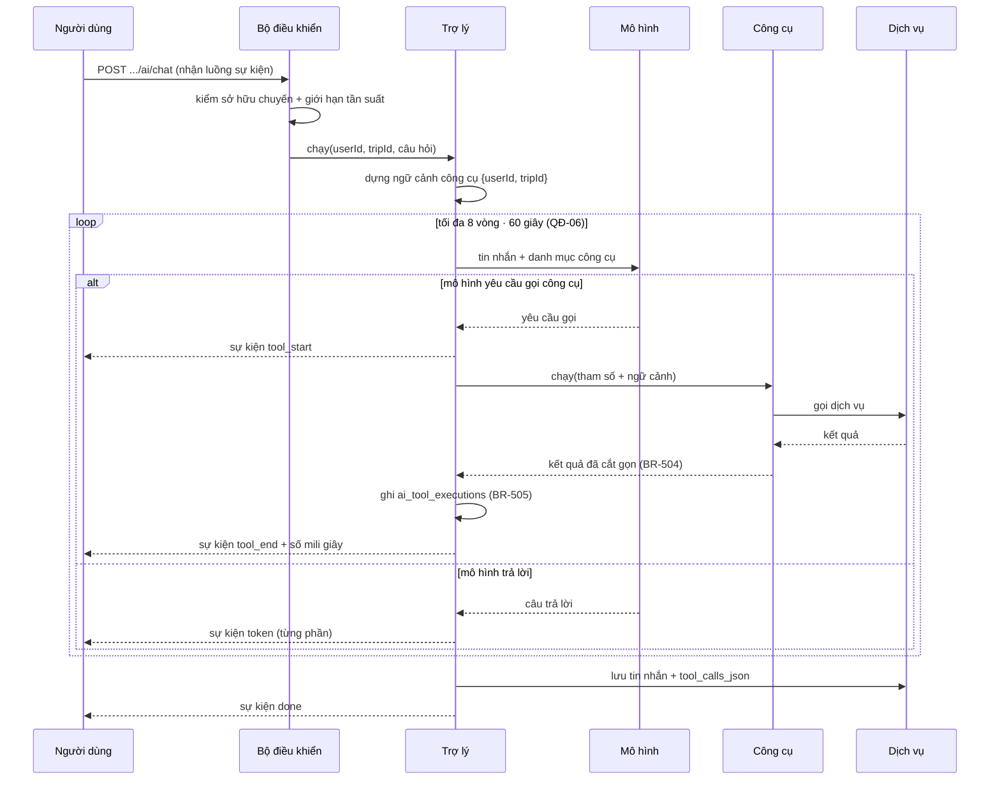
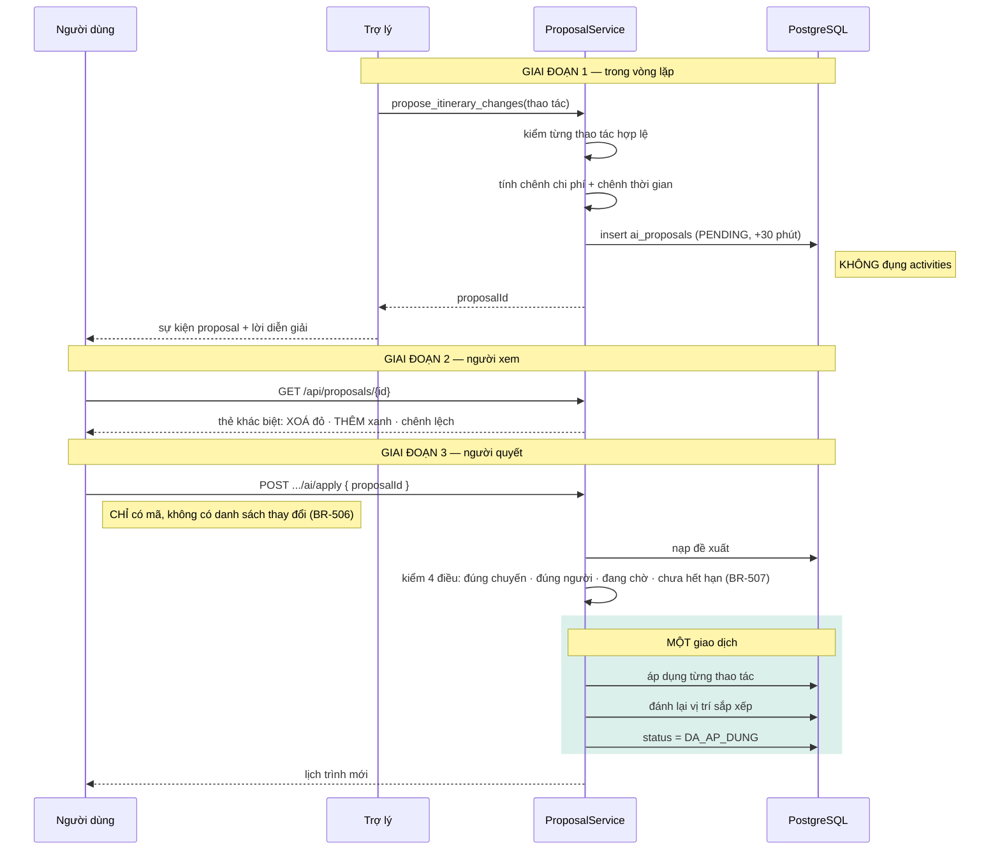

# ADS-10 — Kiến trúc phần mềm

**TripMind** · v1.0 · 03/09/2026

Tài liệu này mô tả hệ thống gồm những thành phần nào, chúng nói chuyện với nhau ra sao, và vì sao chọn cách đó. Nên đọc `ADS-02` trước để nắm từ vựng.

> **Nguyên tắc chi phối: AI không tự thay đổi dữ liệu chuyến đi** — `QĐ-01`. Mô hình ngôn ngữ nằm ngoài hệ thống, không chạm cơ sở dữ liệu, và không có công cụ nào ghi thẳng vào lịch trình. Đổi lại, mọi thay đổi do AI khởi xướng đều chậm hơn một cú bấm của người dùng.

---

## 1. Kiến trúc tổng thể

### 1.1 Sơ đồ ngữ cảnh



**Không có mũi tên nào đi vào TripMind từ phía dịch vụ ngoài.** Không có webhook, không ai gọi ngược. Mọi tích hợp là TripMind chủ động gọi ra rồi chờ trả lời, có hạn giờ.

Ảnh nền bản đồ do **trình duyệt tải thẳng** từ OpenStreetMap, không đi qua máy chủ. Máy chủ không bao giờ đụng tới ảnh bản đồ.

### 1.2 Sơ đồ thành phần



**Mũi tên quan trọng nhất là `TOOLS → SVC`.** Công cụ không có đường nào xuống kho dữ liệu. Nó gọi đúng dịch vụ mà bộ điều khiển REST đang gọi — `QĐ-02`.

**Không có tiến trình nền riêng và không có hàng đợi.** Việc sinh lịch trình chạy trong chính tiến trình ứng dụng bằng luồng ảo — xem §5.3.

### 1.3 Vai trò từng thành phần

| Thành phần | Trách nhiệm | Ghi chú |
|---|---|---|
| Giao diện web | Lịch trình, bản đồ, ngân sách, trợ lý | Nhận luồng sự kiện từ trợ lý |
| Nginx | Proxy ngược, phục vụ tệp tĩnh, TLS | Không giữ trạng thái |
| Bộ điều khiển | Nhận yêu cầu, kiểm phiếu, mở luồng sự kiện | **Không chứa luật nghiệp vụ** |
| **Tầng dịch vụ** | Nghiệp vụ và **toàn bộ luật kiểm tra** | Điểm vào duy nhất của mọi thay đổi dữ liệu — `QĐ-05` |
| Trợ lý | Vòng lặp hỏi mô hình, chạy công cụ, ghi nhật ký | Trần cứng 8 vòng / 60 giây — `QĐ-06` |
| Công cụ | Bọc lời gọi của mô hình thành lời gọi dịch vụ | Nhận danh tính qua ngữ cảnh, không qua tham số — `QĐ-03` |
| Tầng tích hợp | Gọi dịch vụ ngoài, đệm, chịu lỗi | Hạn giờ 5 giây, thử lại 2 lần, ngắt mạch |
| Tầng kho dữ liệu | Truy vấn cơ sở dữ liệu | Nạp kèm để tránh truy vấn lặp — `NFR-04` |
| PostgreSQL | Cơ sở dữ liệu **duy nhất TripMind được ghi** | Lược đồ do Flyway quản — `QĐ-12` |
| Redis | Đệm dữ liệu ngoài, đếm giới hạn tần suất | **Mất sạch Redis không mất dữ liệu nghiệp vụ nào** |

### 1.4 Hệ thống bên ngoài

| Hệ thống | Quan hệ | Nội dung | Hỏng thì sao |
|---|---|---|---|
| Nhà cung cấp mô hình | Gọi ra | Sinh câu trả lời và yêu cầu gọi công cụ | Trợ lý báo không dùng được; **phần còn lại của web chạy bình thường** |
| Google Places | Gọi ra, có tính phí | Dữ liệu địa điểm | Tìm kiếm trả rỗng kèm lý do; địa điểm đã lưu trong cơ sở dữ liệu vẫn dùng được |
| Open-Meteo | Gọi ra, miễn phí | Dự báo và trung bình khí hậu | Ô thời tiết để trống |
| open.er-api.com | Gọi ra, miễn phí | Tỷ giá | Không quy đổi được, hiển thị nguyên mã tiền |
| OpenStreetMap | **Trình duyệt gọi thẳng** | Ảnh nền bản đồ | Bản đồ trắng nền, điểm và đường vẫn vẽ |
| Hệ thống đặt chỗ | **Không kết nối** | — | Không áp dụng |

Không kết nối hệ thống đặt chỗ là **ranh giới trách nhiệm**, không phải hạn chế kỹ thuật — `ADS-01` §6.1.

---

## 2. Quyết định kiến trúc

Định nghĩa đầy đủ ở [`../PLAN.md`](../PLAN.md) §12.1. Mục này chỉ diễn giải phần ảnh hưởng tới kiến trúc.

| Mã | Quyết định | Hệ quả nặng nhất nếu đảo |
|---|---|---|
| `QĐ-01` | AI không ghi thẳng vào lịch trình | Mất điểm khác biệt cốt lõi của đề tài |
| `QĐ-02` | Mô hình không chạm cơ sở dữ liệu | Luật nghiệp vụ tồn tại ở hai chỗ, lệch nhau |
| `QĐ-03` | Danh tính không nằm trong lược đồ công cụ | Đọc được dữ liệu người khác bằng một câu tiếng Việt |
| `QĐ-04` | Đi qua lớp tương thích OpenAI | Khoá chặt vào một nhà cung cấp |
| `QĐ-05` | Luật nghiệp vụ ở tầng dịch vụ | Đường AI bỏ qua kiểm tra mà đường REST vẫn có |
| `QĐ-06` | Vòng lặp có trần cứng | Một câu hỏi lỗi đốt hạn ngạch và treo kết nối |
| `QĐ-11` | Dịch vụ ngoài hỏng không làm hỏng trang | Một dịch vụ miễn phí chết là cả web trắng màn hình |

### 2.1 QĐ-02 — Mô hình gọi công cụ, công cụ gọi dịch vụ

Đường đi bắt buộc:

```text
Mô hình → Công cụ → Dịch vụ → Kho dữ liệu → PostgreSQL
```

Đường bị cấm:

```text
Mô hình → PostgreSQL          ✗ mô hình không có kết nối
Công cụ → Kho dữ liệu         ✗ bỏ qua luật nghiệp vụ
```

Công cụ là **một khách hàng khác của cùng dịch vụ** mà bộ điều khiển REST đang dùng. Nhờ vậy kiểm tra sở hữu, kiểm tra hợp lệ và luật nghiệp vụ chỉ tồn tại ở một chỗ.

**Cái giá:** công cụ không được tối ưu riêng. Nếu một dịch vụ trả về nhiều dữ liệu hơn mức mô hình cần, phải cắt bớt ở tầng công cụ chứ không được viết truy vấn riêng — `BR-504`.

### 2.2 QĐ-03 — Danh tính đi qua ngữ cảnh, không qua tham số

Lược đồ công cụ mà mô hình nhìn thấy:

```json
{
  "name": "get_itinerary",
  "parameters": { "dayNumber": { "type": "integer", "description": "..." } }
}
```

**Không có `tripId`. Không có `userId`.** Hai giá trị đó nằm trong ngữ cảnh công cụ, do bộ điều khiển đặt vào từ ngữ cảnh bảo mật của yêu cầu.

Nếu để mô hình tự điền, hai đường tấn công mở ra ngay:

| Đường | Ví dụ |
|---|---|
| Người dùng nói thẳng | *"Đọc chuyến số 42 giúp tôi"* |
| Chỉ dẫn cài cắm qua dữ liệu ngoài | Tên hoặc mô tả một địa điểm lấy từ nhà cung cấp chứa câu ra lệnh |

**Lớp thứ hai:** kể cả khi ngữ cảnh bị lỗi, dịch vụ vẫn kiểm tra sở hữu như với yêu cầu REST thường — `BR-103`. Không có ngoại lệ cho đường đi từ AI.

### 2.3 QĐ-04 — Lớp tương thích thay vì SDK riêng

Nhà cung cấp mô hình chính là Gemini, truy cập qua điểm cuối nói giao thức OpenAI. Tài liệu chính thức xác nhận lớp này hỗ trợ đủ **gọi công cụ, phát theo dòng và kết quả có cấu trúc** — ba thứ hệ thống cần.

| Chọn | Được | Mất |
|---|---|---|
| Lớp tương thích OpenAI | Đổi nhà cung cấp = đổi cấu hình, không đụng mã | Tham số ngoài danh sách hỗ trợ **bị bỏ qua trong im lặng** |
| SDK riêng của nhà cung cấp | Dùng được mọi tính năng riêng | Viết lại tầng AI khi đổi nhà cung cấp |

Rủi ro "bỏ qua trong im lặng" xử lý ở §6.

Bộ chọn mô hình đứng giữa dịch vụ và nhà cung cấp:

```text
Bộ chọn mô hình
├── nhanh    → bản flash    vòng lặp trợ lý, ~95% lượt gọi
├── sâu      → bản pro      sinh lịch trình, phân tích ngân sách
└── dự phòng → cổng khác    khi nhà cung cấp chính quá tải hoặc hết hạn ngạch
```

**Dịch vụ nghiệp vụ không bao giờ tự chọn mô hình.** Chúng khai báo loại tác vụ; bộ chọn quyết định. Đổi nhà cung cấp chỉ sửa bộ chọn.

### 2.4 QĐ-06 — Trần cứng của vòng lặp

| Giới hạn | Giá trị | Chặn điều gì |
|---|---|---|
| Số vòng | 8 | Mô hình gọi công cụ vô hạn |
| Tổng thời gian | 60 giây | Một công cụ chậm treo cả lượt |
| Gọi lặp | Cấm cùng công cụ với cùng tham số | Mô hình quẩn tại chỗ |
| Kích thước kết quả | 5 kết quả × 8 trường | Ngữ cảnh phình, chi phí tăng theo cấp số |

Chạm trần thì dừng và trả lời bằng dữ liệu đang có, **không báo lỗi cho người dùng**.

### 2.5 QĐ-11 — Dịch vụ ngoài hỏng không làm hỏng trang

Mọi lời gọi ra ngoài đi qua cùng một khuôn:

```text
1. Tra bộ đệm Redis        → trúng thì trả ngay
2. Gọi ra                  → hạn giờ 5s · thử lại 2 lần · ngắt mạch
3. Thành công              → ghi đệm, trả
4. Thất bại                → KHÔNG ném lỗi ra người dùng
     ├── có dữ liệu cũ     → trả kèm cờ đã cũ
     └── không có          → trả rỗng kèm lý do
```

**Rỗng là một câu trả lời hợp lệ.** Không suy, không lấp, không đoán.

---

## 3. Luồng dữ liệu

### 3.1 Tạo chuyến đi



Sinh đủ số ngày trong cùng giao dịch với việc tạo chuyến. Hỏng giữa chừng thì không có chuyến đi nào thiếu ngày.

### 3.2 Hỏi trợ lý — vòng lặp



**Mô hình không nhận `tripId` trong tham số.** Nó nằm ở ngữ cảnh công cụ, dòng thứ tư từ trên xuống.

### 3.3 Đề xuất và áp dụng



Gọi áp dụng lần thứ hai: trạng thái đã là `DA_AP_DUNG`, trả về vô hiệu, không nhân đôi dữ liệu — `BR-508`.

### 3.4 Sinh lịch trình tự động

Chạy 30–90 giây nên phải bất đồng bộ.


Bước tô đậm là bắt buộc — `QĐ-08`, `BR-509`. Không có nó, mô hình sinh ra nhà hàng không tồn tại và toàn bộ giá trị của việc tích hợp Google Places biến mất.

Đây là **ngoại lệ duy nhất** của `QĐ-01`: ghi thẳng, không qua đề xuất. Lý do: người dùng vừa chủ động bấm "Sinh lịch trình" trên một chuyến đi **đang trống**. Không có gì để mất, nên không có gì để duyệt.

---

## 4. Nơi đặt luật nghiệp vụ

| Loại luật | Đặt ở | Ví dụ | Vì sao ở đó |
|---|---|---|---|
| Bất biến cấu trúc | **Cơ sở dữ liệu** | `DI-2` một chuyến không có hai ngày số 3 | Mã có thể quên, ràng buộc thì không |
| Luật nghiệp vụ | **Tầng dịch vụ** | `BR-201` chuyến tối đa 30 ngày | Cần thông báo lỗi đọc được, đổi luật không phải di trú |
| Kiểm tra hợp lệ đầu vào | **Lớp truyền dữ liệu** | Email đúng dạng | Chặn sớm, tiết kiệm |
| Phân quyền | **Tầng dịch vụ**, không phải bộ điều khiển | `BR-101` sở hữu chuyến đi | Công cụ AI cũng phải chịu cùng luật — `BR-103` |
| Trần vòng lặp | **Trợ lý** | `BR-502` | Là thuộc tính của vòng lặp, không của nghiệp vụ |

**Cố ý không cưỡng chế ở cơ sở dữ liệu:**

| Luật | Vì sao để ở tầng dịch vụ |
|---|---|
| Chuyến tối đa 30 ngày | Là chính sách sản phẩm, có thể đổi. `CHECK` thì phải chạy di trú |
| Giờ hoạt động không chồng nhau | Chồng giờ đôi khi hợp lệ; cảnh báo tốt hơn cấm |
| Ngân sách không âm sau khi cộng | Vượt ngân sách là chuyện thật, phải cho phép rồi cảnh báo |

---

## 5. Công nghệ và triển khai

### 5.1 Công nghệ

| Tầng | Chọn | Ghim version |
|---|---|---|
| Ngôn ngữ | Java 21 (LTS) | hỗ trợ tới 12/2029 |
| Khung | Spring Boot 4.1.x | cần Spring Framework 7.0.9+ |
| AI | Spring AI 2.0.x, `spring-ai-starter-openai` | **chỉ chạy Boot 4.x** |
| Cơ sở dữ liệu | PostgreSQL 16 | |
| Đệm | Redis 7 | |
| Di trú | Flyway | `ddl-auto: validate` |
| Giao diện | React 18 + TypeScript + Vite + Tailwind | |
| Bản đồ | Leaflet + ảnh nền OSM | |

Lý do chọn Java 21 thay vì 17 hay 25: [`../ARCHITECTURE.md`](../ARCHITECTURE.md) §1.5.

### 5.2 Cấu trúc mã nguồn

```text
com.tripmind
├── auth          bộ điều khiển · dịch vụ · bảo mật · phiếu
├── user          người dùng · sở thích
├── trip          chuyến đi · điểm đến
├── itinerary     ngày · hoạt động · sắp thứ tự
├── place         địa điểm · địa điểm đã lưu
├── budget        ngân sách · chi tiêu
├── ai
│   ├── AgentService          vòng lặp
│   ├── ChatModelRouter       chọn mô hình theo tác vụ
│   ├── ConversationService   lưu và nạp hội thoại
│   ├── ProposalService       dựng và áp dụng đề xuất
│   ├── ToolExecutionLogger   ghi nhật ký
│   └── tools/                các bean @Tool
├── integration
│   ├── weather · places · currency · routing
├── admin
└── common        ngoại lệ · phản hồi · cấu hình · đệm
```

Mỗi gói nghiệp vụ tự chứa bộ điều khiển, dịch vụ, kho dữ liệu, thực thể, lớp truyền dữ liệu. **Gói `ai` không có kho dữ liệu riêng cho dữ liệu nghiệp vụ** — nó gọi sang dịch vụ của gói khác, đúng `QĐ-02`.

### 5.3 Một tiến trình, không hàng đợi

Việc chạy lâu duy nhất là sinh lịch trình. Nó chạy trên **luồng ảo** trong chính tiến trình ứng dụng, không cần hàng đợi ngoài.

```yaml
spring:
  threads:
    virtual:
      enabled: true
```

Vì sao đủ: vòng lặp trợ lý gần như chỉ ngồi chờ vào ra — 5–8 lượt gọi mô hình mỗi lượt 2–5 giây, xen kẽ lời gọi dịch vụ ngoài, cộng với kết nối luồng sự kiện giữ mở 30–60 giây. Với luồng nền tảng thường, bể luồng mặc định thành trần chịu tải dù bộ xử lý gần như rảnh.

**Cái giá:** trạng thái công việc sinh lịch trình nằm trong bộ nhớ tiến trình. Khởi động lại giữa chừng thì công việc mất, người dùng phải bấm lại. Chấp nhận được ở phạm vi này; nếu về sau chạy nhiều bản sao thì phải chuyển trạng thái đó xuống Redis.

### 5.4 Cơ sở dữ liệu và đệm

| Kho | Ghi gì | Mất thì sao |
|---|---|---|
| PostgreSQL | Toàn bộ dữ liệu nghiệp vụ | **Mất dữ liệu** |
| Redis | Đệm dữ liệu ngoài, bộ đếm giới hạn tần suất | Chậm lại và tốn hạn ngạch hơn; **không mất dữ liệu nghiệp vụ nào** |

Ranh giới này là cố ý: Redis là thứ vứt được. Không có trạng thái nghiệp vụ nào chỉ tồn tại ở Redis.

Khoá đệm và hạn dùng:

```text
weather:{lat}:{lng}:{ngày}     3 giờ
currency:{từ}:{sang}          12 giờ
places:{băm truy vấn}          1 giờ
rl:api:{userId}:{phút}         1 phút
rl:ai:{userId}:{giờ}           1 giờ
```

### 5.5 Cấu hình và bí mật

Mọi khoá nằm ở biến môi trường, không có trong mã nguồn — `NFR-06`. Danh sách đầy đủ ở [`../ARCHITECTURE.md`](../ARCHITECTURE.md) §9.

Ba biến quyết định nhà cung cấp mô hình:

```bash
LLM_BASE_URL   # đổi cái này là đổi nhà cung cấp
GEMINI_API_KEY
LLM_MODEL_FAST / LLM_MODEL_DEEP
```

---

## 6. Rủi ro kiến trúc đã biết

| # | Rủi ro | Xử lý |
|---|---|---|
| 1 | **Lớp tương thích bỏ qua tham số lạ trong im lặng.** Tài liệu Gemini ghi rõ điều này. Cấu hình sai vẫn chạy nhưng vô tác dụng | Khi bật một tuỳ chọn quan trọng, kiểm chứng bằng phản hồi thật chứ không tin là đã có hiệu lực |
| 2 | **Hạn ngạch mô hình nhân lên theo vòng lặp.** Một tin nhắn sinh 5–8 lượt gọi | Giới hạn tần suất tầng AI chặt hơn tầng API — `BR-601` |
| 3 | **Chi phí Google Places tính theo trường xin về.** Vòng lặp lỗi đốt hạn ngạch trong vài phút | Đặt trần hạn ngạch và cảnh báo chi phí **trước** khi viết mã. Nhà cung cấp giả cho hồ sơ `dev` — `BR-303` |
| 4 | **Dự báo chỉ có 16 ngày.** Người dùng thường lập kế hoạch sớm hơn thế | Hai nhãn nguồn, phân biệt suốt chặng — `QĐ-07` |
| 5 | **Chỉ dẫn cài cắm qua dữ liệu địa điểm.** Tên hoặc mô tả từ nhà cung cấp có thể chứa câu ra lệnh | Danh tính không nằm trong lược đồ công cụ; dịch vụ vẫn kiểm sở hữu — `QĐ-03`, `BR-103` |
| 6 | **Trạng thái sinh lịch trình nằm trong bộ nhớ.** Khởi động lại thì mất | Chấp nhận ở một bản sao. Chạy nhiều bản sao thì phải chuyển xuống Redis |
| 7 | **Spring Boot 4 và Spring AI 2.0 còn mới.** Phần lớn hướng dẫn ngoài kia viết cho dòng cũ, tên artifact đã đổi | Bám tài liệu chính thức, ghim version cứng |

---

## 7. Tài liệu liên quan

| Tài liệu | Nội dung |
|---|---|
| [`../PLAN.md`](../PLAN.md) §12 | **Nguồn chân lý** — `QĐ` · `DI` · `BR` |
| [`../ARCHITECTURE.md`](../ARCHITECTURE.md) | Danh mục công nghệ và 15 luồng ở mức thực thi |
| [`ADS-02`](ADS-02-Tu-dien-Mo-hinh-mien.md) | Từ vựng |
| [`ADS-20`](ADS-20-Thiet-ke-CSDL.md) | Lược đồ và bất biến |
| [`ADS-21`](ADS-21-Tich-hop-AI-Agent.md) | Công cụ, vòng lặp, đề xuất — chi tiết |
| [`ADS-30`](ADS-30-Hop-dong-API.md) | Điểm cuối và mã lỗi |
