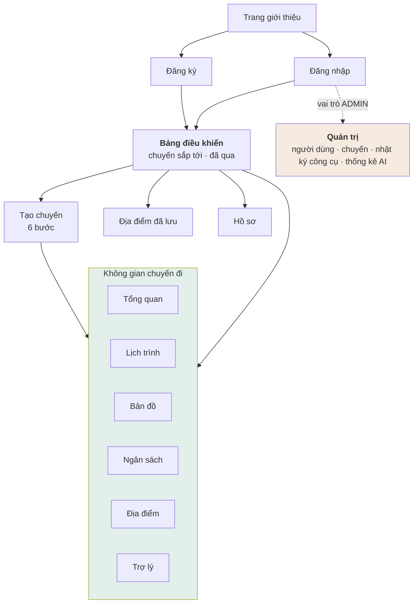

# ADS-40 — Thiết kế màn hình TripMind

**TripMind** · v2.0 · 05/09/2026

> **Bản v2.0 thêm giai đoạn.** Bản v1.0 chỉ phục vụ lúc *trước chuyến*. Bản này thêm màn
> hình cho lúc *đang đi* và *sau chuyến*, thêm hoàn tác và giải trình cho trợ lý — và vì
> thế "bảy chỗ giao diện phải nói thật" ở phần F thành **mười**.

Tài liệu này mô tả có những màn hình nào, mỗi màn hiển thị gì, gọi điểm cuối nào, và **chỗ nào giao diện bắt buộc phải nói thật** thay vì làm đẹp.

---

## Phần A — Nguyên tắc chung

### 1. Ai thấy gì

| Vai trò | Thấy | Không thấy |
|---|---|---|
| Người đi du lịch | **Chỉ chuyến của mình**, toàn quyền sửa | Chuyến của người khác, màn quản trị |
| Quản trị | Danh sách người dùng, danh sách chuyến ở mức tổng hợp, nhật ký chạy công cụ | **Nội dung lịch trình của người khác** |

Một tài khoản một vai trò — `BR-005`. Giao diện quản trị nằm ở nhánh đường dẫn riêng, không trộn vào giao diện người dùng.

### 2. Ba trạng thái của mọi khối dữ liệu

Mọi khối lấy dữ liệu từ máy chủ phải xử lý đủ ba trạng thái. Thiếu một cái là lỗi giao diện.

| Trạng thái | Hiển thị |
|---|---|
| Đang tải | Khung xương, giữ nguyên chiều cao để trang không nhảy |
| Có dữ liệu | Nội dung |
| **Rỗng** | Câu giải thích vì sao rỗng + hành động tiếp theo |

### 3. Rỗng khác với bằng không

Đây là chỗ dễ sai nhất.

| Tình huống | Hiển thị đúng | Hiển thị sai |
|---|---|---|
| Chưa có hoạt động nào trong ngày | "Ngày này chưa có hoạt động. Thêm địa điểm?" | Một ngày trống trơn không nói gì |
| Không lấy được thời tiết | "Chưa có dữ liệu thời tiết cho ngày này" | `0°C` |
| Chưa ghi chi tiêu nào | "Chưa ghi chi tiêu" | `0 ₫` cạnh chữ "đã tiêu" |
| Dịch vụ tìm kiếm lỗi | "Không tra được lúc này, thử lại sau" | "Không tìm thấy kết quả nào" |

**Không suy, không lấp, không đoán** — `QĐ-11`.

### 4. Dự báo khác trung bình khí hậu — không gộp làm một

Hai loại số liệu thời tiết có cùng đơn vị nên rất dễ hiển thị giống nhau. Giao diện **bắt buộc** phân biệt — `QĐ-07`.

| Nhãn nguồn | Hiển thị |
|---|---|
| `DU_BAO` | "Dự báo: mưa 80%" — biểu tượng đầy đủ, màu bình thường |
| `TRUNG_BINH_KHI_HAU` | "Trung bình tháng 10 nhiều năm: hay mưa" — chữ nhạt hơn, có chú thích |

Người dùng phải nhìn ra ngay đâu là dự báo thật. Nói "ngày mai mưa 80%" cho một con số trung bình nhiều năm là nói sai sự thật.

### 5. Đề xuất khác thay đổi — không gộp làm một

Bản đề xuất đã nằm trong cơ sở dữ liệu, có nội dung đầy đủ. Nhưng lịch trình **chưa đổi** — `QĐ-01`.

| Sai | Đúng |
|---|---|
| Cập nhật timeline ngay khi trợ lý đề xuất | Timeline giữ nguyên; đề xuất hiện trong thẻ riêng |
| Nút ghi "OK" | Nút ghi "Áp dụng thay đổi" |
| Thông báo "Đã đổi lịch" ngay sau khi trợ lý nói | Thông báo "Đã áp dụng" **sau khi** máy chủ trả về thành công |

### 6. Tiền hiển thị nguyên, không rút gọn

`8.000.000 ₫`, không phải `8tr` hay `8M`. Người dùng đang đối chiếu ngân sách, con số rút gọn làm mất khả năng kiểm tra. Dùng chữ số căn cột ở mọi bảng có số tiền.

---

## Phần B — Sơ đồ tổng thể



### Danh sách đầy đủ

| # | Màn | Đường dẫn | Vai trò |
|---|---|---|---|
| 1 | Trang giới thiệu | `/` | Công khai |
| 2 | Đăng nhập | `/login` | Công khai |
| 3 | Đăng ký | `/register` | Công khai |
| 4 | Bảng điều khiển | `/app` | Người dùng |
| 5 | Tạo chuyến | `/app/trips/new` | Người dùng |
| 5b | **Nhìn lại** | `/app/trips/:id/review` | Người dùng · chỉ khi chuyến đã kết thúc |
| 6 | Tổng quan chuyến | `/app/trips/:id` | Người dùng |
| 7 | Lịch trình | `/app/trips/:id/itinerary` | Người dùng |
| 8 | Bản đồ | `/app/trips/:id/map` | Người dùng |
| 9 | Ngân sách | `/app/trips/:id/budget` | Người dùng |
| 10 | Địa điểm | `/app/trips/:id/places` | Người dùng |
| 11 | Trợ lý | `/app/trips/:id/assistant` | Người dùng |
| 12 | Địa điểm đã lưu | `/app/saved` | Người dùng |
| 13 | Hồ sơ | `/app/profile` | Người dùng |
| 14 | Quản trị — người dùng | `/admin/users` | Quản trị |
| 15 | Quản trị — chuyến đi | `/admin/trips` | Quản trị |
| 16 | **Quản trị — nhật ký công cụ** | `/admin/tool-executions` | Quản trị |
| 17 | Quản trị — thống kê AI | `/admin/ai-usage` | Quản trị |

Trợ lý (11) đồng thời là **thanh bên** mở được từ mọi tab của không gian chuyến đi, không chỉ là một tab riêng.

---

## Phần C — Màn công khai

### 1. Đăng nhập / Đăng ký

Gọi `POST /api/auth/login` · `/register`.

| Chi tiết | Yêu cầu |
|---|---|
| Sai thông tin | Một câu chung: "Email hoặc mật khẩu không đúng". **Không nói cái nào sai** |
| Phiếu | Lưu vào bộ nhớ, phiếu làm mới lưu nơi bền vững |
| Làm mới tự động | Bộ chặn bắt `401`, gọi làm mới, chạy lại yêu cầu cũ. Làm mới hỏng thì về trang đăng nhập |
| Đang gửi | Khoá nút, hiện trạng thái đang xử lý |

---

## Phần D — Màn người dùng

### 4. Bảng điều khiển

Gọi `GET /api/trips?status=upcoming` và `?status=past`.

```text
Chào buổi sáng!

Chuyến sắp tới
┌──────────────────────────────┐
│ Đà Nẵng                      │
│ 20/10 — 23/10                │
│ 4 ngày · 2 người             │
│ ████████░░  72% đã lên lịch  │
└──────────────────────────────┘
```

| Chi tiết | Yêu cầu |
|---|---|
| `72% đã lên lịch` | Từ trường `planningProgress` — `BR-207`. Có chú giải: "số ngày đã có ít nhất 2 hoạt động" |
| Chưa có chuyến nào | "Chưa có chuyến đi nào. Tạo chuyến đầu tiên?" + nút |
| Cảnh báo ngân sách | Chỉ hiện khi `warningLevel` khác `NONE` |
| Cảnh báo thời tiết | Chỉ hiện với ngày có `source = DU_BAO`. **Không cảnh báo dựa trên trung bình khí hậu** |

### 5. Tạo chuyến — 6 bước

Trạng thái giữ ở máy khách, **gửi một lời gọi duy nhất** ở bước cuối — `ADS-30` §4.

| Bước | Nội dung | Kiểm tại chỗ |
|---|---|---|
| 1 | Điểm đến | Phải chọn một mục trong danh sách |
| 2 | Ngày đi, ngày về | Ngày về không trước ngày đi; tối đa 30 ngày |
| 3 | Số người, kiểu đi | Số người ≥ 1 |
| 4 | Ngân sách, tiền tệ | Không âm |
| 5 | Sở thích | Chọn nhiều, có thể bỏ trống |
| 6 | Phong cách đi | Thư giãn · Cân bằng · Dày đặc |

| Chi tiết | Yêu cầu |
|---|---|
| Quay lại bước trước | Bắt buộc có, không mất dữ liệu đã nhập |
| Bước 5–6 | Điền sẵn từ sở thích mặc định của người dùng |
| Kiểm ở bước 2 | Kiểm ngay tại bước, không đợi tới bước 6 mới báo |
| Nút cuối | "Tạo chuyến đi" → sang tổng quan; **chưa gọi AI** |

### 6. Tổng quan chuyến

```text
Đà Nẵng · 20/10 — 23/10
4 ngày · 2 người

Ngân sách    8.000.000 ₫
Ước tính     7.350.000 ₫
Còn lại        650.000 ₫

Thời tiết   Dự báo 29°C, mưa 20%
```

| Chi tiết | Yêu cầu |
|---|---|
| Chuyến còn trống | Hiện khối gợi ý "Sinh lịch trình bằng AI" kèm mô tả sẽ mất khoảng một phút |
| Số liệu thời tiết | Kèm nhãn nguồn — Phần A §4 |
| Chưa đặt ngân sách | "Chưa đặt ngân sách" + liên kết, **không hiện `0 ₫`** |

### 7. Lịch trình

Gọi `GET /api/trips/:id/itinerary` — một lời gọi lấy cả cây.

```text
Ngày 1 — 20 tháng 10

09:00  Đến sân bay Đà Nẵng
       Đi lại · chưa có địa điểm

11:00  Ăn trưa
       Ăn uống

14:00  Ngũ Hành Sơn          ⭐ 4.5
       Tham quan · 60.000 ₫
       ↓ 8,2 km · khoảng 18 phút

17:30  Bãi biển Mỹ Khê
```

| Chi tiết | Yêu cầu |
|---|---|
| Hoạt động không có địa điểm | Hiển thị bình thường, chỉ ghi loại hoạt động — `DI-4`. **Không hiện chỗ trống hay dấu hỏi** |
| Kéo thả | Thả xong gọi `reorder` với **cả danh sách** — `BR-204`. Hỏng thì trả về thứ tự cũ và báo |
| Khoảng cách giữa hai điểm | Chỉ hiện khi **cả hai** có toạ độ |
| Hoạt động do AI tạo | Có dấu nhỏ phân biệt, từ trường `createdBy` |
| Ngày trống | "Ngày này chưa có hoạt động" + nút thêm |

### 8. Bản đồ

| Chi tiết | Yêu cầu |
|---|---|
| Chọn ngày | Dùng lại dữ liệu đã có từ màn lịch trình, **không gọi thêm** |
| Điểm | Đánh số theo thứ tự trong ngày |
| Đường nối | Nối theo đúng thứ tự |
| Hoạt động không toạ độ | **Bỏ qua, không báo lỗi** — `FR-804`. Có dòng nhỏ: "2 hoạt động không hiện trên bản đồ" |
| Bấm vào điểm | Cuộn tới hoạt động tương ứng ở danh sách bên cạnh |
| Ảnh nền không tải được | Nền xám, **điểm và đường vẫn vẽ** |

### 9. Ngân sách

| Chi tiết | Yêu cầu |
|---|---|
| Hai cột riêng | **Ước tính** và **Thực tế** tách rời, không cộng — `BR-402` |
| Thanh cảnh báo | Bình thường → gần hết (>90%) → vượt (>100%) |
| Vượt ngân sách | **Không chặn.** Hiện cảnh báo, người dùng vẫn thêm được — `ADS-20` §3.2 |
| Khác mã tiền tệ | Nhóm riêng, không cộng vào — `BR-401` |
| Chưa có chi tiêu | "Chưa ghi chi tiêu nào" |

### 10. Địa điểm

| Chi tiết | Yêu cầu |
|---|---|
| Chờ gõ xong mới tìm | Khoảng 400 ms |
| Kết quả | Tên, loại, đánh giá, mức giá, khoảng cách tới điểm đến |
| Mỗi kết quả | Hai nút: "Lưu" và "Thêm vào ngày…" |
| Dịch vụ lỗi | "Không tra được lúc này" — **khác** với "không tìm thấy" |
| Ghi nguồn | Dòng ghi nguồn theo yêu cầu của nhà cung cấp |
| Đã lưu rồi | Nút "Lưu" đổi trạng thái, không cho bấm lại — `DI-7` |

### 11. Trợ lý

Màn quan trọng nhất của hệ thống.

```text
┌────────────────────────────────────┐
│ Trợ lý TripMind               ×    │
├────────────────────────────────────┤
│ Bạn:                               │
│ Ngày mai mưa thì đổi lịch giúp tôi │
│                                    │
│ ✓ Đang đọc chuyến đi        120ms  │
│ ✓ Đang kiểm tra thời tiết   320ms  │
│ ✓ Đang tìm địa điểm trong nhà 430ms│
│ ✓ Đang tính khoảng cách      85ms  │
│                                    │
│ Trợ lý:                            │
│ Dự báo ngày mai mưa 80%. Tôi đề    │
│ xuất đổi hai hoạt động ngoài trời. │
│                                    │
│ ┌────────────────────────────────┐ │
│ │ ĐỀ XUẤT THAY ĐỔI               │ │
│ │                                │ │
│ │ − Bãi biển Mỹ Khê      15:00   │ │
│ │ + Bảo tàng Chăm        14:30   │ │
│ │ + Chợ Hàn              16:30   │ │
│ │                                │ │
│ │ Chi phí      +50.000 ₫         │ │
│ │ Di chuyển    −18 phút          │ │
│ │ Ngân sách    7,4tr / 8tr       │ │
│ │                                │ │
│ │ [Áp dụng thay đổi]  [Huỷ]      │ │
│ └────────────────────────────────┘ │
├────────────────────────────────────┤
│ Hỏi bất cứ điều gì về chuyến đi... │
└────────────────────────────────────┘
```

| Chi tiết | Yêu cầu |
|---|---|
| Dòng công cụ | Hiện **ngay từ sự kiện đầu tiên**, không đợi trả lời xong |
| Thời gian mỗi công cụ | Hiện thật từ `tool_end.ms` |
| Câu trả lời | Hiện dần theo từng phần |
| **Thẻ đề xuất** | Timeline **không đổi** cho tới khi bấm áp dụng — Phần A §5 |
| Thêm màu đỏ / xanh | Kèm ký hiệu `−` `+`, không chỉ dựa vào màu |
| Sau khi áp dụng | Thẻ chuyển sang "Đã áp dụng", timeline làm mới |
| Thao tác bị bỏ qua | Hiện rõ cái nào bỏ và vì sao — `ADS-30` §10.3 |
| Đề xuất quá hạn | Thẻ chuyển sang "Đã hết hạn", nút áp dụng biến mất |
| Chạm trần vòng lặp | Vẫn hiện câu trả lời, **không hiện lỗi** |
| Vượt giới hạn tần suất | "Bạn đã hỏi khá nhiều, thử lại sau N phút" |
| Nhà cung cấp lỗi | "Trợ lý tạm thời không dùng được." **Các tab khác vẫn chạy** |

### 12–13. Địa điểm đã lưu · Hồ sơ

Màn đơn giản. Địa điểm đã lưu có nút "Thêm vào chuyến…" chọn chuyến rồi chọn ngày.

---

## Phần E — Màn quản trị

### 16. Nhật ký chạy công cụ — màn quan trọng nhất của nhánh quản trị

Gọi `GET /api/admin/tool-executions`.

| Cột | Nội dung |
|---|---|
| Thời điểm | |
| Người dùng | |
| Công cụ | |
| Trạng thái | `OK` xanh · `ERROR` đỏ · `TIMEOUT` cam |
| Thời gian chạy | Mili giây, căn cột phải |
| Tham số / Kết quả | Mở rộng được, JSON đã cắt gọn |

Lọc theo người, công cụ, trạng thái, khoảng ngày.

> Đây là màn **phải giữ lại kể cả khi cắt scope** — nó là bằng chứng nhìn thấy được rằng trợ lý thực sự gọi công cụ chứ không tự bịa câu trả lời.

### 14–15, 17. Người dùng · Chuyến đi · Thống kê AI

Bảng chỉ đọc, có phân trang. **Không có nút sửa nội dung chuyến đi** — `FR-906`.

---

## Phần F — Những chỗ giao diện phải nói thật

Tổng hợp lại, đây là mười chỗ mà làm đẹp sẽ thành nói dối:

| # | Chỗ | Phải nói thật rằng |
|---|---|---|
| 1 | Số liệu thời tiết | Đây là dự báo, hay là trung bình nhiều năm — `QĐ-07` |
| 2 | Thẻ đề xuất | Lịch trình **chưa đổi** cho tới khi bấm áp dụng — `QĐ-01` |
| 3 | Chi phí | Đây là **ước tính do người dùng nhập**, không phải giá thị trường |
| 4 | Thông tin địa điểm | Đây là ảnh chụp lúc tra, hệ thống không biết chỗ đó còn mở không |
| 5 | Dịch vụ ngoài lỗi | "Không tra được" khác với "không có kết quả" |
| 6 | Khối rỗng | Rỗng khác với bằng không |
| 7 | Hoạt động do AI tạo | Phân biệt được với hoạt động người dùng tự thêm |
| 8 | **Hộp xác nhận hoàn tác** | Phần bạn sửa tay sẽ **được giữ nguyên**, nên lịch trình không quay về đúng như trước. Và địa điểm đã ghi vào CSDL thì không rút lại |
| 9 | **Chế độ đang đi** | Giai đoạn này **suy từ ngày** hay **bạn tự bật**. Ngày đang xem có phải hôm nay thật không |
| 10 | **Hệ số ước sai** | Nó **không** được cộng vào tổng ước tính. Hạng mục thiếu một vế thì ghi "chưa đủ dữ liệu", không ghi 0% |

Ba chỗ mới đều cùng một dạng sai: một con số hoặc một trạng thái **trông như sự thật đo
được**, nhưng thực ra là suy đoán, là lựa chọn của người dùng, hoặc là phép chia thiếu một
vế. Chỗ nào cũng dễ làm cho gọn bằng cách giấu đi — và giấu đi là nói dối.

---

## Phần H — Ba giai đoạn của một chuyến đi

Bản v1.0 coi mọi chuyến như nhau. Thực ra một chuyến đi qua ba giai đoạn, và **cùng một màn
hình phải nói chuyện khác nhau** ở mỗi giai đoạn.

| Giai đoạn | Suy từ | Màn Lịch trình hiện gì | Thanh đo trên thẻ chuyến |
|---|---|---|---|
| Chưa đi | `TODAY < startDate` | Danh sách ngày, kéo thả được | **% đã lên lịch** — số ngày có ≥2 hoạt động |
| Đang đi | `startDate ≤ TODAY ≤ endDate` | Thêm dải **Hôm nay** + nút đánh dấu từng hoạt động | **% đã đi qua** — số hoạt động đã xong hoặc đã bỏ |
| Đã xong | `TODAY > endDate` | Như trên, cộng tab **Nhìn lại** | **% đã đi qua** |

Hai thanh đo là **hai chỉ số khác nhau**, hai nhãn khác nhau, và không được trộn. Hiện
"75% đã lên lịch" cho một chuyến đã kết thúc là vô nghĩa.

### H.1 Người dùng đặt tay được, và giao diện phải nói ra

Giai đoạn suy từ ngày là mặc định, nhưng người dùng đặt tay được — về sớm, đi muộn, hoặc
ngồi viết nhật ký sau chuyến. Khi đang đặt tay:

| Chỗ | Phải hiện |
|---|---|
| Thanh tiêu đề chuyến | Chip **"bạn tự đặt"** cạnh tên giai đoạn |
| Dải Hôm nay | "Ngày 1 **(mô phỏng)**" và một dòng nói rõ hôm nay thật là ngày mấy |

Đây là chỗ số 9 của phần F. Một chip ghi "Đang đi" trong khi hôm nay chưa tới ngày khởi
hành mà không chú thích gì là giao diện nói sai.

### H.2 Lệch lịch — hai nguồn, hai cách nói

| Nguồn | Khi nào | Câu phải khác nhau |
|---|---|---|
| `ACTUAL` | Hoạt động đã xong muộn hơn dự kiến | "**Đã trễ** 40 phút" |
| `NOW` | Hoạt động đang làm và đã quá giờ | "**Đang trễ** 40 phút tính tới lúc này" |

Cái thứ hai còn thay đổi được — người dùng có thể xong trong năm phút nữa. Nói "đã trễ"
cho một việc chưa kết thúc là chốt một con số chưa chốt.

**Hệ thống không tự dời giờ.** Nó tính ra bạn trễ bao nhiêu rồi để trợ lý dựng đề xuất.
Tự dời là AI ghi thẳng vào dữ liệu, phá `QĐ-01`.

### H.3 Ảnh — nói thẳng khi không lưu được

Kho ảnh có thể không dùng được (chế độ riêng tư, giao thức tệp cục bộ). Khi đó giao diện
**từ chối nhận ảnh và nói rõ**, chứ không nhận rồi để mất im lặng:

> "Trình duyệt này không cho lưu ảnh. Bạn vẫn ghi được dòng cảm nhận."

Cùng một nếp với "không tra được khác với không có kết quả".

---

## Phần G — Tình trạng hiện tại

Chưa có mã giao diện. Thứ tự dựng màn theo [`../PLAN.md`](../PLAN.md) §7:

| Tuần | Màn |
|---|---|
| 1 | Đăng nhập · Đăng ký |
| 2 | Bảng điều khiển · Tạo chuyến · Tổng quan |
| 3 | Lịch trình |
| 4 | Địa điểm · Địa điểm đã lưu |
| 5 | Bản đồ · Ngân sách |
| 7–9 | Trợ lý (dòng công cụ ở tuần 8, thẻ đề xuất ở tuần 9) |
| 11 | Quản trị |

---

## Tài liệu liên quan

| Tài liệu | Nội dung |
|---|---|
| [`../PLAN.md`](../PLAN.md) §12 | **Nguồn chân lý** |
| [`ADS-01`](ADS-01-Dac-ta-yeu-cau.md) §7 | Truy vết yêu cầu sang màn hình |
| [`ADS-30`](ADS-30-Hop-dong-API.md) | Điểm cuối mỗi màn gọi |
| [`ADS-21`](ADS-21-Tich-hop-AI-Agent.md) §3.3 | Các sự kiện màn Trợ lý nhận |
