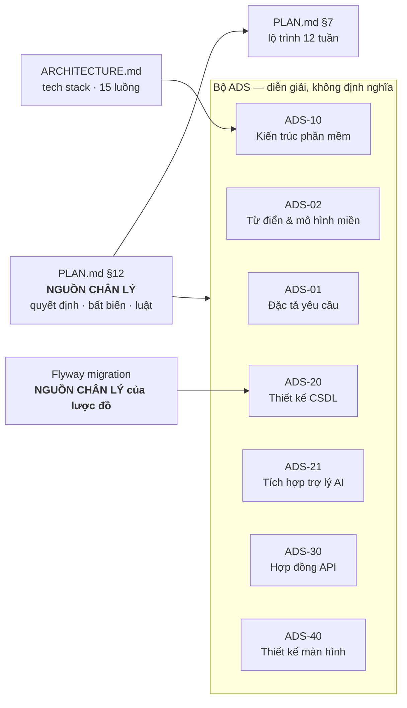

# TripMind — Bộ tài liệu

**v1.0 · 03/09/2026**

---

## Đọc theo thứ tự nào

**Người mới bắt đầu từ đâu:**

| Bạn là ai | Đọc theo thứ tự |
|---|---|
| Lập trình viên mới vào | `ADS-02` từ điển → `ADS-10` §1 → `ADS-20` |
| Người viết backend | `PLAN.md` §12 → `ADS-20` → `ADS-30` |
| Người làm phần AI | `ADS-21` **toàn bộ** → `ADS-10` §3.2–3.4 → `ADS-20` §2.12–2.14 |
| Người viết giao diện | `ADS-40` → `ADS-30` |
| Người viết báo cáo | `ADS-01` → `ADS-10` → `ADS-21` |
| Kiểm thử | `PLAN.md` §12.3 (28 luật `BR`) → `ADS-30` §1.1 |

---

## Danh mục

### Nguồn chân lý — sửa ở đây trước

| Tệp | Nội dung |
|---|---|
| [`../PLAN.md`](../PLAN.md) §12 | **12 quyết định `QĐ` · 12 bất biến `DI` · 28 luật `BR`.** Mọi tài liệu khác diễn giải chứ không định nghĩa |
| [`../PLAN.md`](../PLAN.md) §7 | Lộ trình 12 tuần · 3 mốc · thứ tự cắt scope khi trễ |
| [`../ARCHITECTURE.md`](../ARCHITECTURE.md) | Danh mục công nghệ · cấu hình nhà cung cấp mô hình · 15 luồng ở mức thực thi |
| `backend/.../db/migration/` | **Lược đồ.** Chưa viết — xem `ADS-20` §5 |

### Bộ ADS

| Mã | Tệp | Trả lời câu gì |
|---|---|---|
| `ADS-01` | [Đặc tả yêu cầu](ADS-01-Dac-ta-yeu-cau.md) | Hệ thống phải làm được gì, và không làm gì |
| `ADS-02` | [Từ điển & mô hình miền](ADS-02-Tu-dien-Mo-hinh-mien.md) | Một từ trong tài liệu nghĩa là gì, ánh xạ sang cột nào |
| `ADS-10` | [Kiến trúc phần mềm](ADS-10-Kien-truc-phan-mem.md) | Có những thành phần nào, ai gọi ai |
| `ADS-20` | [Thiết kế CSDL](ADS-20-Thiet-ke-CSDL.md) | Mỗi bảng mỗi cột chứa gì, bất biến nào cưỡng chế ở đâu |
| `ADS-21` | [Tích hợp trợ lý AI](ADS-21-Tich-hop-AI-Agent.md) | Trợ lý gọi công cụ ra sao, vì sao nó không được tự ghi |
| `ADS-30` | [Hợp đồng API](ADS-30-Hop-dong-API.md) | Điểm cuối, mã lỗi, phân quyền |
| `ADS-40` | [Thiết kế màn hình](ADS-40-Luong-giao-dien.md) | Màn nào hiển thị gì, gọi điểm cuối nào |

### Tài liệu nguồn

| Tệp | Nội dung |
|---|---|
| [`../../TripMind_AI_Travel_Planner.md`](../../TripMind_AI_Travel_Planner.md) | Đề cương gốc. **Bộ ADS này sửa lược đồ ở bốn chỗ** so với đề cương — xem `PLAN.md` §5 |

---

## Ký hiệu dùng chung

| Mã | Nghĩa | Danh mục ở |
|---|---|---|
| `QĐ-xx` | Quyết định kiến trúc — không đảo trong lúc làm. **12 cái** | `PLAN.md` §12.1 |
| `DI-x` | Bất biến **cưỡng chế ở tầng CSDL** — **12 cái** | `PLAN.md` §12.2 · `ADS-20` §3.1 |
| `BR-xx` | Luật **tầng dịch vụ phải tự kiểm** — **28 cái**, mỗi cái một ca kiểm thử | `PLAN.md` §12.3 |
| `FR-xxx` | Yêu cầu chức năng | `ADS-01` §4 |
| `NFR-xx` | Yêu cầu phi chức năng | `ADS-01` §5 |

---

## Ba điều dễ hiểu sai nhất

**1. Bản đề xuất không phải là thay đổi.**
Đề xuất đã nằm trong cơ sở dữ liệu, có mã, có nội dung đầy đủ — nên rất dễ tưởng nó "đã xảy ra". Nó chưa. Lịch trình chỉ đổi ở bước áp dụng, sau một cú bấm của người dùng — `QĐ-01`. Ba trong bốn trạng thái của một đề xuất không đổi gì cả.

**2. Mô hình ngôn ngữ không biết người dùng là ai.**
`userId` và `tripId` **không nằm trong lược đồ công cụ**. Chúng đi qua ngữ cảnh công cụ, lấy từ ngữ cảnh bảo mật của yêu cầu — `QĐ-03`. Nếu để mô hình tự điền, một câu *"đọc chuyến số 42 giúp tôi"* là đủ để đọc dữ liệu người khác. Và kể cả vậy, dịch vụ vẫn kiểm sở hữu — `BR-103`. Không có ngoại lệ cho đường đi từ AI.

**3. Dự báo và trung bình khí hậu là hai loại số liệu khác nhau.**
Open-Meteo chỉ dự báo được 16 ngày — đã kiểm chứng bằng lời gọi thật. Xa hơn thì chỉ có trung bình nhiều năm. Hai loại có cùng đơn vị nên rất dễ đối xử như nhau, nhưng nói "ngày mai mưa 80%" cho một con số trung bình là nói sai sự thật. Nhãn nguồn đi từ dịch vụ, qua công cụ, vào lời nhắc, ra tới giao diện — rơi ở tầng nào cũng hỏng — `QĐ-07`.

---

## Bốn chỗ lược đồ khác đề cương gốc

| Chỗ | Đề cương gốc | Bộ ADS này | Vì sao |
|---|---|---|---|
| `ai_proposals` | **Không có bảng** | Thêm mới | Không có nó thì điểm cuối áp dụng buộc phải tin danh sách thay đổi do máy khách gửi — ai cũng bỏ qua được AI |
| `activities.place_id` | `NOT NULL` | Cho phép rỗng, thêm `title` | "Ăn trưa", "Đến sân bay" không gắn địa điểm nào |
| `messages` | `role` + `content` | Thêm `tool_calls_json`, `tool_call_id`, `token_usage` | Không có thì không dựng lại được lịch sử hội thoại có công cụ ở lượt sau |
| `weather_cache` | Bảng PostgreSQL | **Bỏ, chuyển sang Redis** | Dữ liệu vứt được, có hạn dùng tự nhiên. Ở PostgreSQL thì phải tự dọn rác |

Chi tiết ở [`../PLAN.md`](../PLAN.md) §5.
