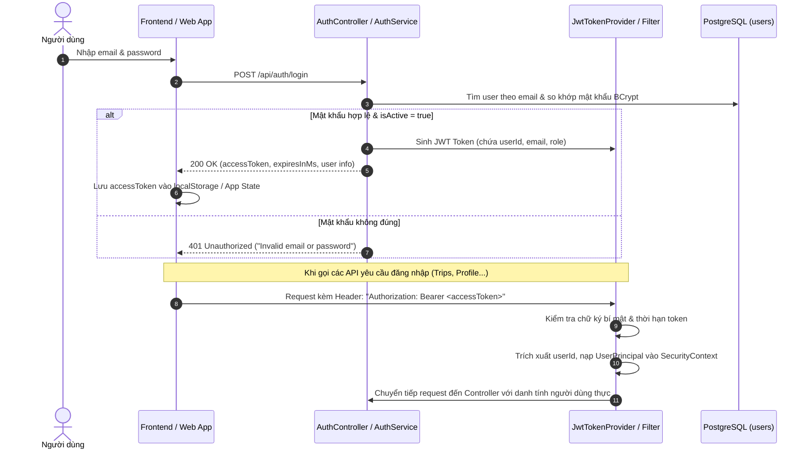
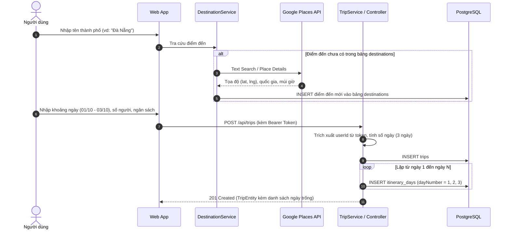
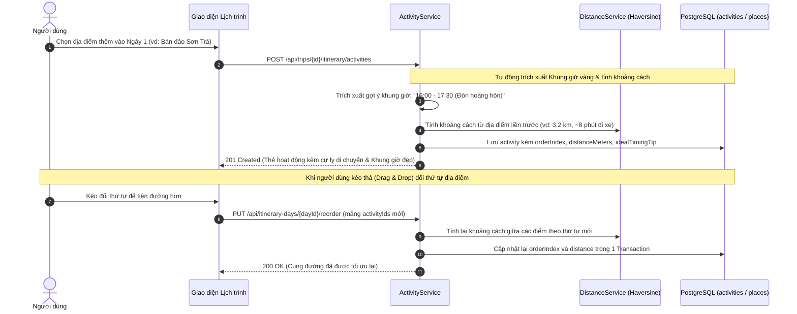
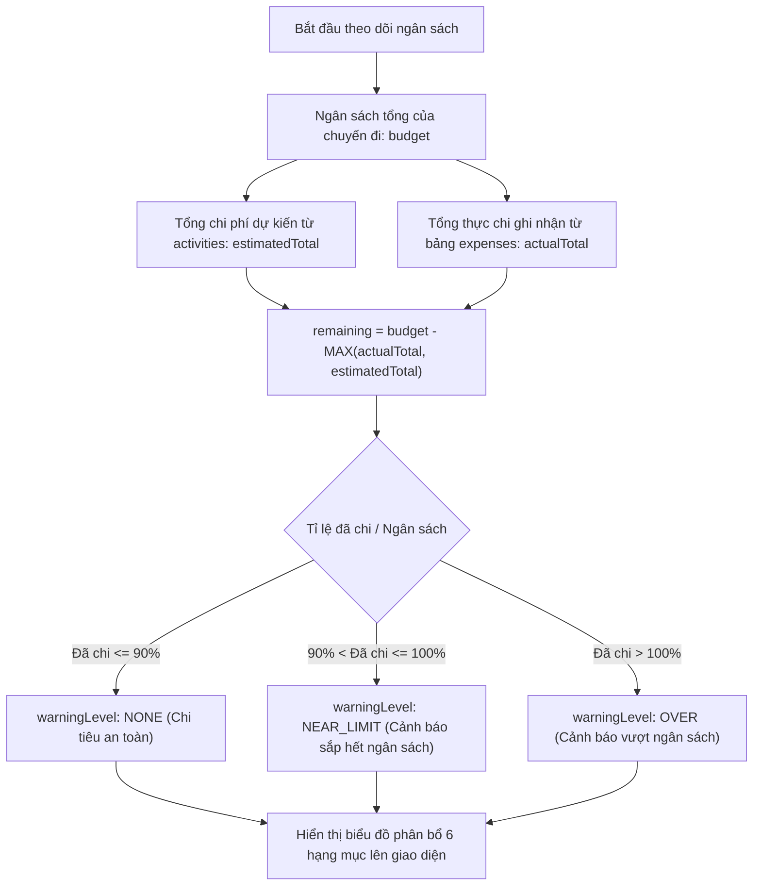
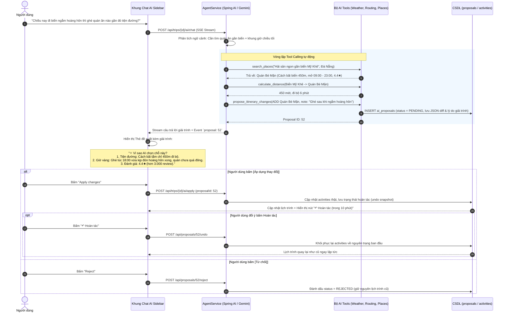

# TripMind AI — Kiến trúc Tính năng và Luồng Hoạt động (Workflows)

Tài liệu mô tả chi tiết danh mục tính năng và sơ đồ luồng hoạt động (workflows) cho nền tảng **TripMind AI — Lập kế hoạch và Quản lý chuyến du lịch thông minh**.

---

## 1. Triết lý thiết kế cốt lõi

Khác với các ứng dụng du lịch truyền thống thường gò bó người dùng vào một "thời khóa biểu công sở" từng phút (09:00 - 10:30 - 11:45), **TripMind AI** xây dựng theo triết lý **Du lịch thư giãn & Linh hoạt**:

1. **Lịch trình theo Cụm địa điểm & Khoảng cách di chuyển (Location Clustering & Routing):**
   - Không ép buộc giờ giấc cố định. Các hoạt động trong ngày được sắp xếp theo thứ tự **tiện đường đi nhất**, gom cụm theo buổi (Sáng / Chiều / Tối).
   - Luôn hiển thị **khoảng cách (km)** và **thời gian di chuyển ước tính (phút)** giữa 2 điểm liên tiếp để người dùng chủ động lộ trình, không bị chạy lòng vòng.
2. **Gợi ý "Khung giờ vàng" (Ideal Timing / Best Time to Visit):**
   - Thay vì ép giờ hành chính, mỗi địa điểm chỉ gắn kèm gợi ý thời điểm đẹp nhất:
     - *Ngắm cảnh / Check-in:* Khung giờ bình minh (05:00 - 05:45), hoàng hôn (16:30 - 17:45), tránh nắng gắt trưa hè.
     - *Ăn uống / Mua sắm:* Khung giờ quán mở cửa, tránh giờ cao điểm đông đúc/xếp hàng.
     - *Sự kiện:* Giờ diễn ra hoạt động đặc biệt (Cầu Rồng phun lửa, chợ đêm...).
3. **Giải trình AI minh bạch (Explainable AI — "Vì sao AI chọn chỗ này?"):**
   - AI không phải là "hộp đen". Mỗi đề xuất của AI đều giải trình 3 yếu tố: **Tiện đường** (cách điểm trước bao xa) + **Khung giờ vàng** (vì sao nên ghé lúc này) + **Đánh giá uy tín & giờ mở cửa**.
4. **Hoàn tác an toàn (Undo Proposal):**
   - Sau khi duyệt thay đổi do AI đề xuất, người dùng luôn có nút **↶ Hoàn tác** để khôi phục lại lịch trình nguyên trạng ban đầu chỉ với 1 chạm.

---

## 2. Bảng tổng hợp phân hệ tính năng

| Phân hệ | Tính năng chi tiết | Trạng thái hiện tại |
| :--- | :--- | :--- |
| **1. Xác thực & Tài khoản** | • Đăng ký tài khoản (mã hóa mật khẩu BCrypt, chống trùng email) • Đăng nhập & cấp JWT Access Token (không dùng refresh token) • Phân quyền RBAC (`ROLE_USER`, `ROLE_ADMIN`) bằng Spring Security • Quản lý Profile (tên, avatar) và Đổi mật khẩu |  **Đã hoàn thành** |
| **2. Điểm đến & Khám phá địa điểm** | • Danh mục điểm đến nội bộ kết hợp tra cứu toàn cầu qua Google Places • Tìm kiếm địa điểm, xem chi tiết (rating, review, giờ mở cửa) • Gợi ý địa điểm lân cận theo tọa độ điểm đến • Lưu danh sách địa điểm yêu thích (`saved_places`) | 🟡 **Đã xong tra cứu** ⏳ Chờ API lưu địa điểm |
| **3. Khởi tạo & Quản lý chuyến đi** | • Wizard tạo chuyến đi (Điểm đến, ngày đi/về, số người, ngân sách, phong cách) • Tự động tính số ngày và khởi tạo lịch trình rỗng (`itinerary_days`) • Xem danh sách chuyến đi của người dùng đã đăng nhập |  **Đã hoàn thành** |
| **4. Lịch trình linh hoạt & Cụm địa điểm** | • Xem danh sách địa điểm theo từng ngày theo thứ tự tối ưu cung đường • **Khoảng cách di chuyển**: Hiển thị cự ly (km) và thời gian đi giữa các điểm • **Gợi ý Khung giờ vàng**: Bình minh, hoàng hôn, giờ mở cửa quán ăn, tránh đông đúc • Sắp xếp lại thứ tự hoạt động trong ngày (Kéo thả / Reorder API) | ⏳ **Kế hoạch tiếp theo** |
| **5. Ngân sách & Chi tiêu thực tế** | • Phân bổ ngân sách theo 6 hạng mục (Lưu trú, Ăn uống, Di chuyển, Vé, Mua sắm, Khác) • Ghi nhận chi tiêu thực tế phát sinh trong chuyến đi (`expenses`) • So sánh chi phí dự kiến vs thực tế, cảnh báo vượt hạn mức (`NEAR_LIMIT`, `OVER`) | ⏳ **Kế hoạch tiếp theo** |
| **6. Dịch vụ ngoài (Weather & FX)** | • Dự báo thời tiết từng ngày trong chuyến theo tọa độ điểm đến (Open-Meteo) • Tự động quy đổi ngoại tệ theo tỷ giá thời gian thực | ⏳ **Kế hoạch tiếp theo** |
| **7. Trợ lý AI (AI Agent)** | • Chatbot ngữ cảnh chuyến đi (Chat Server-Sent Events - SSE Stream qua Gemini) • **Tool Calling**: AI tự gọi API nội bộ đọc thời tiết, lịch trình, khoảng cách • **Giải trình AI**: Nêu rõ lý do chọn điểm (tiện đường, giờ vàng, rating) • **Proposal & Apply**: AI đề xuất đổi lịch trình, người dùng duyệt mới lưu vào DB • **Hoàn tác an toàn (Undo)**: Khôi phục lại lịch trình trước khi duyệt đề xuất | ⏳ **Kế hoạch tiếp theo** |

---

## 3. Sơ đồ luồng hoạt động chi tiết (Mermaid Workflows)

### 3.1. Luồng Xác thực & Phân quyền (Authentication & Authorization)
*Đã hoàn thành trong mã nguồn backend.*

---

### 3.2. Luồng Khởi tạo chuyến đi & Tự động sinh ngày (Trip Creation)
*Đã hoàn thành trong mã nguồn backend.*

---

### 3.3. Luồng Lịch trình linh hoạt: Cụm địa điểm, Khoảng cách & Khung giờ vàng
*Kế hoạch tiếp theo — Tập trung vào sự thoải mái của người dùng.*

---

### 3.4. Luồng Theo dõi Ngân sách & Cảnh báo chi tiêu (Budget & Expenses)
*Kế hoạch tiếp theo.*

---

### 3.5. Luồng Trọng tâm: AI Agent Trò chuyện, Giải trình & Hoàn tác an toàn (Proposal, Explain & Undo)
*Kế hoạch tiếp theo — Cốt lõi AI Agent của đề tài.*

---

## 4. Lộ trình triển khai các bước tiếp theo

1. **Bước 1: Quản lý Lịch trình linh hoạt & Hoạt động (Itinerary & Activities)**
   - Triển khai CRUD hoạt động (`activities`) tập trung vào **thứ tự tiện đường** và **thẻ ghi chú Khung giờ vàng**.
   - Triển khai `DistanceService` tính khoảng cách (km) và thời gian di chuyển giữa các điểm liền kề.
   - Triển khai API sắp xếp thứ tự kéo thả (`reorder`).
   - Triển khai API lưu địa điểm yêu thích (`saved_places`).
2. **Bước 2: Dịch vụ ngoài (Weather & Currency Exchange)**
   - Tích hợp Open-Meteo theo tọa độ điểm đến.
   - Tích hợp Exchange Rate API quy đổi ngoại tệ.
3. **Bước 3: Quản lý Chi tiêu & Ngân sách (Budget & Expenses)**
   - Triển khai CRUD chi tiêu thực tế (`expenses`).
   - Tích hợp `BudgetService` trả về tổng hợp và cảnh báo hạn mức.
4. **Bước 4: Nền tảng AI Chatbot & Agent Tools (Gemini Integration)**
   - Tích hợp Spring AI / Gemini Client.
   - Xây dựng endpoint SSE Stream `POST /api/trips/{id}/ai/chat`.
   - Cài đặt 5 công cụ đọc (`get_current_trip`, `get_itinerary`, `get_weather`, `search_places`, `calculate_trip_budget`).
5. **Bước 5: Cơ chế Đề xuất, Giải trình & Hoàn tác an toàn (AI Proposal, Explain & Undo)**
   - Xây dựng công cụ `propose_itinerary_changes` kèm metadata giải trình (`evidence_json`, `reason`).
   - API xem trước diff & giải trình (`GET /api/proposals/{id}`).
   - API phê duyệt (`POST /api/trips/{id}/ai/apply`), từ chối (`POST /api/proposals/{id}/reject`) và hoàn tác (`POST /api/proposals/{id}/undo`).
